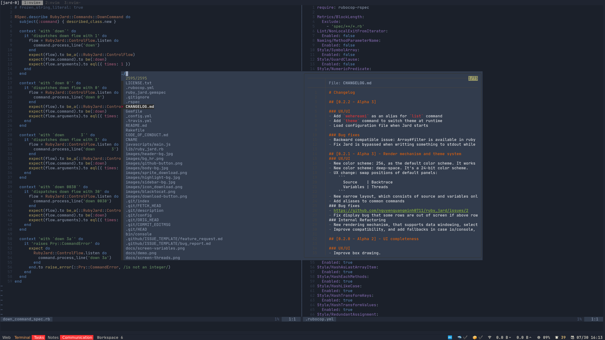

# My personal dotfiles

This repo contains my personal dotfiles. I use Ubuntu (with i3). I love (Neo)vim. I work on Ruby, Golang, and C.



## Setup guide

- Install dependencies:

```bash
sudo apt-get install git xclip curl tmux ripgrep zsh lua5.3 cargo python3-pip clang libfontconfig1-dev automake libevent-dev htop xcb
```

- Clone this repository and `cd` into cloned folder

```
mkdir -p ~/www && git clone git@github.com:nguyenquangminh0711/dotfiles ~/www/
```

- Setup zsh

```bash
mkdir -p "$HOME/.zsh"
git clone https://github.com/sindresorhus/pure.git "$HOME/.zsh/pure"
git clone git@github.com:zsh-users/zsh-syntax-highlighting.git $HOME/.zsh/zsh-syntax-highlighting.git
git clone git@github.com:skywind3000/z.lua $HOME/.zsh/z.lua
ln -s $(pwd)/.zshrc $HOME/.zshrc
```

- Make `zsh` default terminal with `chsh`

- Setup tmux

```bash
git clone https://github.com/tmux-plugins/tpm ~/.tmux/plugins/tpm
git clone https://github.com/jimeh/tmux-themepack.git ~/.tmux-themepack
ln -s $(pwd)/.tmux.conf $HOME/.tmux.conf
```

- Install alacritty

```
cargo install alacritty
ln -s $(pwd)/alacritty.yml ~/.config/.alacritty.yml
```

- Download and install nvim

```bash
sudo curl https://github.com/neovim/neovim/releases/download/v0.4.3/nvim.appimage -L --output /usr/local/bin/nvim
sudo chmod +x /usr/local/bin/nvim
mkdir -p $HOME/.config/nvim/
sudo ln -s $(pwd)/.vimrc $HOME/.vimrc
sudo ln -s $(pwd)/.vimrc $HOME/.config/nvim/init.vim
curl -fLo ~/.local/share/nvim/site/autoload/plug.vim --create-dirs \
    https://raw.githubusercontent.com/junegunn/vim-plug/master/plug.vim
```

- Symlink vim to nvim

```bash
sudo ln -s $(which nvim) /usr/local/bin/vim
```

- Plug Install

- Install Node and NPM: https://linuxize.com/post/how-to-install-node-js-on-ubuntu-18.04/

- Install python neovim:

```bash
pip2 install pynvim
pip3 install pynvim
```

- Install desired languages:
  - https://www.digitalocean.com/community/tutorials/how-to-install-ruby-on-rails-with-rbenv-on-ubuntu-18-04
  - https://golang.org/dl/

- Install Coc lang servers: https://github.com/neoclide/coc.nvim/wiki/Language-servers
- Install https://regolith-linux.org/docs/getting-started/install/
- Symlink regolith config

```
mkdir -p $HOME/.config/ && ln -s $(pwd)/regolith $HOME/.config/regolith
```

- Update .Xresources. `vim ~/.Xresources-regolith`

```
! -- This points to the default looks Xresource root file.
#include "$HOME/.config/regolith/styles/lascaille/root"
```

- Ignored `compile_flags.txt` out of all repository

```
echo "compile_flags.txt" >> ~/.gitignore_global
git config --global core.excludesfile ~/.gitignore_global
```

- Install https://github.com/BambooEngine/ibus-bamboo
- Install typora: https://support.typora.io/Typora-on-Linux/
- Install dropbox: https://www.dropbox.com/install-linux
- Install nice replacements for famous command lines
    - `sudo apt-get install fd-find`
    - `lazygit`
    - `bat`
    - `rg`
    - `exa`
